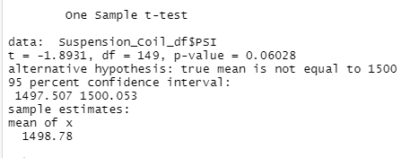
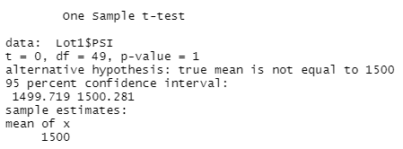
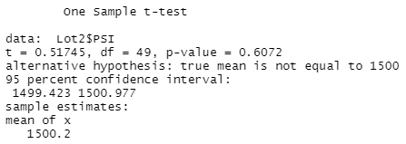
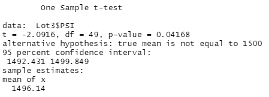

# MechaCar_Statistical_Analysis
Using R for vehicle analysis

## Linear Regression to Predict MPG
According to our summary, when we look at the Pr(>|t|) values, the variables for vehicle length and ground clearance in addition to the intercept (MPG), are statistically unlikely to provide random amounts of variance to the linear model. The slope of the linear model is not considered to be zero because the p-value of 5.35e-11 is much smaller than our assumed significance level of 0.05%. We can now say that there is enough evidence to reject our null hypothesis and conclude that the slope of our inear model is not zero. Looking at the r-squared value and p-value, we can conclude that the model is effective in predicting the mpg of MechaCar prototypes.

## Summary Statistics on Suspension Coils
If you look at the total summary of all the lots, the variance is 69.3 pounds per square inch (PSI) . This is comfotably under the 100 PSI threshold. When you look at the lot summary the variance is 1.0 PSI and 7.5 PSI for lots 1 and 2, respectively. However, when you look at lot 3 the variance is 170.3 PSI which is well above the 100 PSI maximum. So, in conclusion, the vehicles in lot 3 do not meet the design specification, but all of the other lots do.

## T-Tests on Suspension Coils
### All Lots
Looking at the first T-Test we ran where we tested the PSI across all manufacturing lots to see if the PSI was statistically different from the population mean of 1,500 PSI. As you can see below, the mean of all three lots was 1,498.78 PSI along with a p-value of 0.06028. Therefore, we cannot reject the null hypothesis and say the mean across all three lots is statistically different than 1,500 PSI. Here are the results of the t-test:

### Lot 1
Looking at the second T-Test we ran where we tested the PSI across Lot 1 to see if the PSI was statistically different from the population mean of 1,500 PSI. As you can see below, the mean of Lot 1 is  1,500 PSI along with a p-value of 1. Therefore, we cannot reject the null hypothesis and say the mean PSI of Lot 1 is statistically different than 1,500 PSI. Here are the results of the t-test:

### Lot 2
Looking at the third T-Test we ran where we tested the PSI across Lot 2 to see if the PSI was statistically different from the population mean of 1,500 PSI. As you can see below, the mean of Lot 2 is  1,500.2 PSI along with a p-value of 0.6072. Therefore, we cannot reject the null hypothesis and say the mean PSI of Lot 2 is statistically different than 1,500 PSI. Here are the results of the t-test:

### Lot 3
Looking at the fourth T-Test we ran where we tested the PSI across Lot 3 to see if the PSI was statistically different from the population mean of 1,500 PSI. As you can see below, the mean of Lot 3 is  1,500 PSI along with a p-value of 0.04168. Therefore, we can reject the null hypothesis and say the mean across all three lots is statistically different than 1,500 PSI. Here are the results of the t-test:

